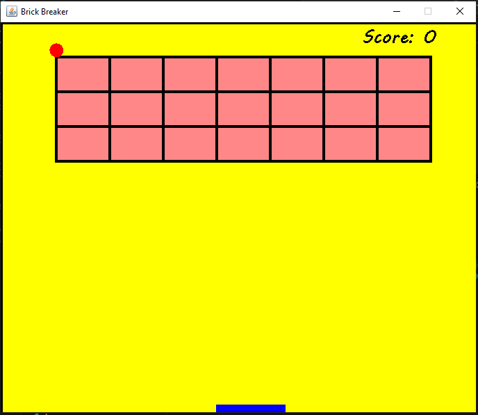

# Brick Breaker Game

A simple Brick Breaker game implemented in Java using Swing.

## Description

This game features a classic Brick Breaker setup, where the player controls a paddle to bounce a ball and break bricks. The objective is to clear all the bricks with the ball to win the game.

## Features

- Interactive paddle control using arrow keys
- Ball interaction with bricks and paddle
- Score tracking for each brick hit
- Game Over and Victory screens
- Restart option with Enter key

## How to Play

1. Use the **right arrow key** to move the paddle to the right.
2. Use the **left arrow key** to move the paddle to the left.
3. Press the **Enter key** to restart the game after Game Over or Victory.

## Screenshots



## Getting Started

### Prerequisites

- Java Development Kit (JDK) installed

### Build and Run

1. Clone the repository:

   ```bash
   git clone https://github.com/carpentarycoder/Brick-breaker-game.git
   ```

2. Navigate to the project directory:

   ```bash
   cd brick-breaker-game
   ```

3. Compile the Java code:

   ```bash
   javac Main.java
   ```

4. Run the game:

   ```bash
   java Main
   ```

## Author

SUTAR


